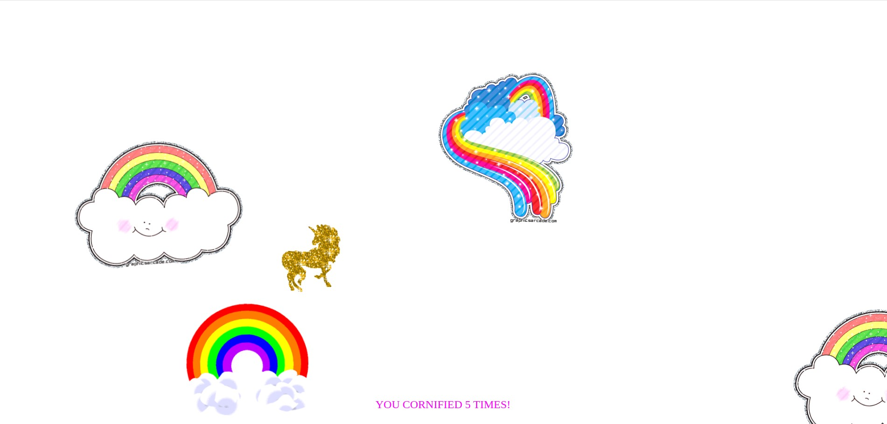

# Key-Sequence-Detection

A fun little project that listens for a specific sequence of keystrokes on your keyboard and triggers an Easter egg when the sequence is matched. This project uses JavaScript to detect a secret code and then runs a quirky animation using the [Cornify](https://www.cornify.com/) library.

## 🚀 Demo

Type `asad` on your keyboard while the page is open, and enjoy the surprise! 🎉

## 📁 Project Structure

```
Key-Sequence-Detection/
│
├── index.html        # Main HTML file containing the script
├── cornify.js        # External script for adding fun effects (unicorns, rainbows, etc.)
└── README.md         # Project documentation
```

## 📦 Features

- Listens to key presses (`keyup` events)
- Detects a custom secret code (`asad`)
- Triggers a visual effect using `cornify_add()` from the Cornify library
- Logs pressed keys to the console for debugging

## 🛠 How It Works

- Each key press is stored in the `pressed` array.
- The array maintains only the last N keys, where N is the length of the `secretCode`.
- When the sequence of keys matches the secret code, an animation is triggered.


## 📦 Requirements

Just a browser! No frameworks or external dependencies (other than `cornify.js`).

## 🧙‍♂️ Customize

Want to change the secret code? Modify this line in the script:

```javascript
const secretCode = 'your-secret-code';
```

You can also replace or customize the effect inside the `if` condition.

## 🖼 Preview



## 🧩 Credits

- [Cornify](https://www.cornify.com/) for the magical visual effects ✨
- Inspired by Wes Bos' [JavaScript 30](https://javascript30.com/) series

## 📜 License

MIT License